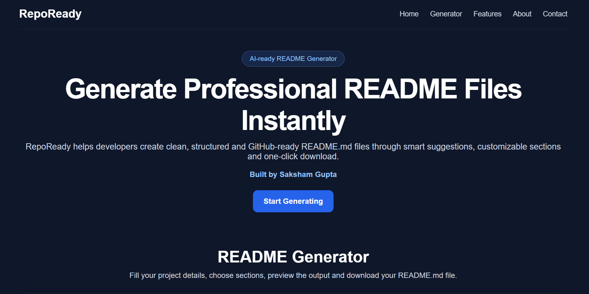

# RepoReady - AI Powered README Generator

    RepoReady is an AI-powered README generator that helps developers create clean, professional, and GitHub-ready README.md files. It includes chatbot-assisted input, smart section selection, multiple templates, live Markdown preview, one-click download, and AI-based README generation using OpenRouter.

    


## Project Links

- Repository: [View on GitHub](https://github.com/saksham944-tech/RepoReady)
- Live Demo: [Open Project](https://repoready-79tx.onrender.com)

## Screenshots



## Table of Contents

- [Project Links](#project-links)
- [Screenshots](#screenshots)
- [Features](#features)
- [Tech Stack](#tech-stack)
- [Installation](#installation)
- [Usage](#usage)
- [Project Structure](#project-structure)
- [Future Scope](#future-scope)
- [Author](#author)
- [License](#license)

## Features

- AI-powered README generation
- Chatbot-style project detail collection
- Multiple README templates
- Smart README section suggestions
- Custom section selection
- Live Markdown preview
- Raw Markdown output
- One-click README.md download
- Copy README to clipboard
- Tech badge generation
- Project links and screenshot support
- Responsive official website layout
- Full-stack backend integration
- Online deployment on Render

## Tech Stack

- HTML
- CSS
- JavaScript
- Node.js
- Express
- OpenRouter API
- Marked.js
- Font Awesome
- Render
- GitHub

## Installation

```bash
npm install
```

## Usage

```bash
npm start
```

## Project Structure

```
RepoReady/
public/
public/index.html
public/style.css
public/script.js
public/screenshots/home.png
server.js
package.json
package-lock.json
.env.example
.gitignore
```

## Future Scope

- Add project file scanning
- Detect tech stack automatically
- Generate README from uploaded package.json or requirements.txt
- Add GitHub repository import
- Add user authentication
- Add more README templates
- Add export history
- Add AI-based README improvement suggestions
- Improve UI animations
- Add dark and light theme toggle

## Author

Saksham Gupta

GitHub: https://github.com/saksham944-tech

## License

This project is licensed under the MIT License.

